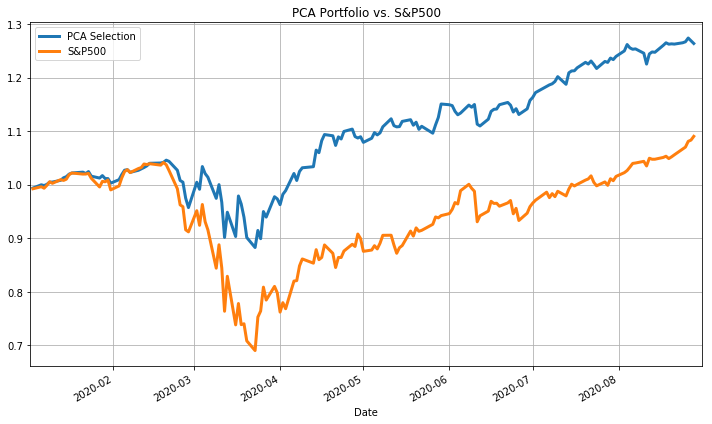
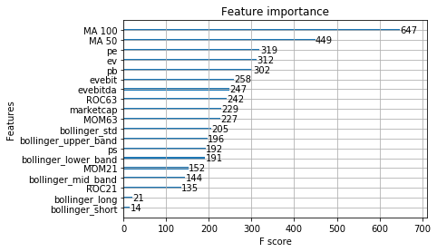

# Project_2
Exploring algorithmic trading techniques applied to a basket of securities
# Group 3 Project-2 (UofT FinTech Bootcamp)

__Title__: Using Machine Learning to select a portfolio of stocks mimicking and beating S&P500 
__Group members__: Amar Munipalle, Nitesh Jain, Sinthushan Sooriyakuamar, Veldurai Lakshmanan  

## 1. Introduction of the Project

This project uses Principal Component Analysis (PCA) to select a portfolio of stocks which are most suited to beat S&P500 index on a daily basis. These stocks are further subjected to Machine Learning Algorithms with different technical and fundamental indicators as input matrix. The most useful indicators as per the Supervised machine learning models are then used to predict the future movement of the selected stocks. This algo trading model could be tweaked to suit different risk tolerance and trading styles of different portfolio managers or individual investors.

### 1.1 Technical Tools Used

| Tool | Details |
| ---- | ------- |
| Language | Python 3.0 implemented through Jupyter Notebook |
| Libraries |  Data preparation and Visualization: Pandas, Hvplot, SciKit Learn, Numpy and Plotly, XGBoost |
| APIs | Yahoo Finance, Beautiful Soup, Alpaca trade API, Quandl,  |

### 1.2 Related Files

[Trading Algo ipynb File](TradingAlgo.ipynb)

[S&P 500 Closing Price Data CSV File](data.csv)

### 1.3 Data sources and preparation

The historical data of S&P500 was downloaded from Yahoo Finance and was manipulated using Pandas functions. Using this data, the daily returns of individual stocks and cumulative returns of S&P500 stocks was determined.

## 2. Principal Component Analysis (PCA)

The PCA technique was applied on the above dataset in an attempt to select stoks which most closely mimicks the S&P500 movement. The purpose behind this step was to replicate the movement of S&P500 with as few individual stocks as possible. This would help an investor to invest in S&P500 without buying all the 500 stocks. 

PCA essentially selects the stocks which can mimick the movement of S&P500 and by our application of further analytical techniques, we will try and keep the positive upswing factors while reducing the downward causing stocks.

The following graph indicates that our PCA stocks closely follows the movement of S&P500.

The code could be tweaked to find out the "Stocks with most/least negative PCA weights". Further changes can be done as per the convenience of the investor.

## 3. Application of Technical and Fundamental Indicators

### 3.1 Feature Construction

We begin by constructing a dataset that contains the input features which will be used to make the predictions, and the output variable.

Our dataset is built using raw data comprising of the close price series for different stocks. The individual stocks and index data consists of Date, Open, High, Low, Close and Volume. Using this data we calculated our indicators based on various technical indicators i.e. 
Moving Average(MA), Exponential Moving Average(EMA), Stochastic Oscillator %K and %D, Bollinger Bands(BOL), Rate Of Change(ROC), Momentum (MOM) and 
Fundamental indicators i.e. Enterprise Value(EV), Enterprise Value to EBIT ratio (evebit), Enterprise Value to EBITDA ratio (evebitda), Market Capitalization (marketcap), Price-to-Book value (pb), Price-to-Earnings value (pe),Price-to-Sales value (ps).

| Feature Name | Feature Description |
| ------------ | ------------------- |
| __Moving Average(MA)__ | In statistics, a moving average is a calculation used to analyze data points by creating a series of averages of different subsets of the full data set. In finance, a moving average (MA) is a stock indicator that is commonly used in technical analysis. Moving averages are usually calculated to identify the trend direction of a stock or to determine its support and resistance levels. It is a trend-following—or lagging—indicator because it is based on past prices. The reason for calculating the moving average of a stock is to help smooth out the price data by creating a constantly updated average price. |
| __Exponential Moving Average(EMA)__ | An exponential moving average (EMA) is a type of moving average (MA) that places a greater weight and significance on the most recent data points. An exponentially weighted moving average reacts more significantly to recent price changes than a simple moving average (SMA), which applies an equal weight to all observations in the period. |
|  __Stochastic Oscillator %K and %D(STOK & STOD)__ | A stochastic oscillator is a momentum indicator comparing a particular closing price of a security to a range of its prices over a certain period of time. The sensitivity of the oscillator to market movements is reducible by adjusting that time period or by taking a moving average of the result. The Stochastic Oscillator is displayed as two lines. The main line is called "%K." The second line, called "%D," is a moving average of %K. The %K line is usually displayed as a solid line and the %D line is usually displayed as a dotted line. |
| __Bollinger Bands(BOL)__ | A Bollinger Band is a technical analysis tool defined by a set of trendlines plotted two standard deviations (positively and negatively) away from a simple moving average (SMA) of a security's price, but which can be adjusted to user preferences. Bollinger Bands use 2 parameters, Period and Standard Deviations, StdDev. Bollinger bands help determine whether prices are high or low on a relative basis. They are used in pairs, both upper and lower bands and in conjunction with a moving average.|
| __Rate Of Change(ROC)__ | The Price Rate of Change (ROC) is a momentum-based technical indicator that measures the percentage change in price between the current price and the price a certain number of periods ago. The ROC indicator is plotted against zero, with the indicator moving upwards into positive territory if price changes are to the upside, and moving into negative territory if price changes are to the downside. The indicator can be used to spot divergences, overbought and oversold conditions, and centerline crossovers. |
| __Momentum (MOM)__ | Momentum measures the rate of the rise or fall in stock prices. From the standpoint of trending, momentum is a very useful indicator of strength or weakness in the issue's price. History has shown us that momentum is far more useful during rising markets than during falling markets; the fact that markets rise more often than they fall is the reason for this. In other words, bull markets tend to last longer than bear markets. |
| __Enterprise Value(EV)__ | Enterprise value (EV) is an indicator of how the market attributes value to a firm as a whole. Enterprise value is a term coined by analysts to discuss the aggregate value of a company as an enterprise rather than just focusing on its current market capitalization or market cap.The market cap figure measures how much you need to fork out to buy an entire public company. When sizing up a company, investors get a better picture of the real value with enterprise value compared to market cap. |
| __Enterprise Value to EBIT ratio (evebit)__ | The enterprise value to earnings before interest and taxes (EV/EBIT) ratio is a metric used to determine if a stock is priced too high or too low in relation to similar stocks and the market as a whole.EV/EBIT is commonly used as a valuation metric to compare the relative value of different businesses. It is typically used in Relative Business Valuation Models, the ratio is used to compare two companies with similar financial, operating, and ownership profiles. |
| __Enterprise Value to EBITDA ratio (evebitda)__ | The enterprise value (EV) to the earnings before interest, taxes, depreciation, and amortization (EBITDA) ratio varies by industry. However, the EV/EBITDA for the S&P 500 has typically averaged from 11 to 14 over the last few years. EBITDA measures a firm's overall financial performance, while EV determines the firm's total value. As of Jan. 2020, the average EV/EBITDA for the S&P 500 was 14.20. As a general guideline, an EV/EBITDA value below 10 is commonly interpreted as healthy and above average by analysts and investors. |
| __Market Capitalization (marketcap)__ | Market cap—or market capitalization—refers to the total value of all a company's shares of stock. It is calculated by multiplying the price of a stock by its total number of outstanding shares. It allows investors to understand the relative size of one company versus another. Large-cap companies are typically firms with a market value of $10 billion or more. Mid-cap companies are typically businesses with a market value between $2 billion and $10 billion. Small-cap companies are typically those with a market value of $300 million to $2 billion.|
| __Price-to-Book value (pb)__ | The price-to-book ratio compares a company's market value to its book value. It's calculated by dividing the company's stock price per share by its book value per share (BVPS). An asset's book value is equal to its carrying value on the balance sheet, and companies calculate it netting the asset against its accumulated depreciation. Some people may know this ratio by its less common name, price-equity ratio. |
| __Price-to-Earnings value (pe)__ | The Price/Earnings Ratio (P/E Ratio) is an indicator that plots a company's share price divided by the earnings per share (EPS). It is a popular measure that can be used to see if a stock is fairly valued, overvalued or undervalued. A general interpretation is that a company with a high P/E Ratio is expected to have higher earnings growth in the future. P/E ratios are used by investors and analysts to determine the relative value of a company's shares in an apples-to-apples comparison. |
| __Price-to-Sales value (ps)__ | The price-to-sales (P/S) ratio is a valuation ratio that compares a company’s stock price to its revenues. It is an indicator of the value that financial markets have placed on each dollar of a company’s sales or revenues. Like all ratios, the P/S ratio is most relevant when used to compare companies in the same sector. A low ratio may indicate the stock is undervalued, while a ratio that is significantly above the average may suggest overvaluation. |

Visual representation of our features.

### 3.2 Feature Selection &  Modeling

Feature selection is the process of selecting a subset of features that are most relevant for model construction which aid in creating an accurate predictive model. Using this, one automatically or manually selects those features which contribute most to the prediction variable or output in which one is interested in.

Having irrelevant features in your data can decrease the accuracy of the models and make your model learn based on irrelevant features.The importance of feature selection can best be recognized when you are dealing with a dataset that contains a vast number of features. This type of dataset is often referred to as a high dimensional dataset. Now, with this high dimensionality, comes a lot of problems such as - this high dimensionality will significantly increase the training time of your machine learning model, it can make your model very complicated which in turn may lead to Overfitting.

There are a wide range of feature selection algorithms, and these mainly fall in one of the three categories:

Filter method– selects features by assigning a score to them using some statistical measure. Wrapper method– evaluates different subset of features, and determines the best subset. Embedded method – This method figures out which of the features give the best accuracy while the model is being trained.

In our model, we will use filter method utilising the XGBoost Classifier function. XGBoost stands for eXtreme Gradient Boosting. It is an implementation of gradient boosted decision trees designed for speed and performance. In prediction problems involving unstructured data (images, text, etc.) artificial neural networks tend to outperform all other algorithms or frameworks.

The models that form the ensemble, also known as base learners, could be either from the same learning algorithm or different learning algorithms. Bagging and boosting are two widely used ensemble learners. Though these two techniques can be used with several statistical models, the most predominant usage has been with decision trees.

### 3.3 Training and Testing Split with sklearn

The train-test split procedure is used to estimate the performance of machine learning algorithms when they are used to make predictions  on data not used to train the model. This is a fast and easy procedure to perform, the results of which allows one to compare the performance of machine learning algorithms for the predictive modeling problem.

We evaluate the accuracy of the best model on actual unseen data to have the estimation more concrete. Meaning that we will use the algorithm on the training set and use the model on the test set afterwards for validation. We split the dataset into 80% training set and 20% test set. The outcome variable "y" is the "good trade" column of the dataframe which signifies the daily returns of the stock when they have beaten S&P500 daily returns.

### 3.4 Evaluation Metrics
As is the industry standard, we ran our alogrithm through different evaluation metrics and the results are summarised below.

Accuracy Score: 0.9316822206269443

Confusion Matrix

Classification Report:

## 4. Predictions and Conclusion

After running the machine learning model, XG Boost classifier, on the selected stcoks, we chose the top-10 stocks with the least Root-Mean-Squared-Error(RMSE). These stocks are listed below along with their respective RMSE. A low RMSE indicates an overall robust model for predictions.

1. Kimberley Clark Corp

2. Colgate Palmolive Comp

3. Costco Wholesale Corp

4. Johnson & Johnson

5. Dollar General Corp

6. Campbell Soup Company

7. Akamai Technologies Inc

8. Kinross Gold Corp

9. CH Robinson Worldwide Inc

10. Consolidated Edison Inc

Extra. Amazon

## 5. Challenges

### 5.1  Challange Description

It is a trade-off between time and effort as to whether to spend time in finding the best formatted data or to find a data and then spend time to cleaning and formatting it. As a team, we spend more time in finding the right sets of data which made our efforts in data cleaning,  relatively easier.

| Challenge | Description |
| -------------- | ----------- |
| __Find the relative data for research__ | The first challenge is to find the relative data which is to be used in research. The second-by-second data is by subscription and more suited to high frequency traders. We used daily closing prices to build and test our model. |
| __Model Selection__ | The next challenge was to select from a variety of machine learning models available. As each model has its pros and cons, we debated and tested a bunch of them to finalise the most suited one for our purpose. |

### 5.2 Future Improvemnent

The stock market is an ever changing playground with many unforeseen and sudden events. A model which is successful on a given period, may be a poor performer in a very quick succession. The model developed should be tested and updated on a regular basis for maintaining a consistent robustness.
## 6. References
 1. investopedia.com
 2. medium.com
